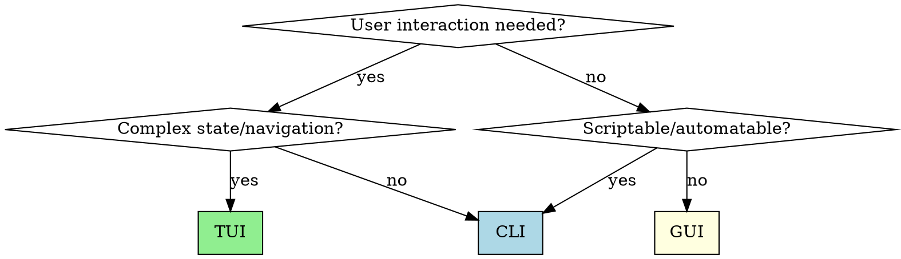

# Building CLI Applications

## Overview

CLI apps are **filters in a pipeline**. They read input, transform it, write output. The Unix philosophy applies: do one thing well, compose with others.

## When to Use CLI vs TUI vs GUI



**Choose CLI when:** Single operation, pipeable, scriptable, CI/CD, simple prompts
**Choose TUI when:** Dashboard, multi-view navigation, real-time monitoring
**Choose GUI when:** Non-technical users, complex visualizations, drag/drop

## Quick Reference: Libraries by Language

| Language | Argument Parsing | Progress/Spinners | Colors | Prompts |
|----------|-----------------|-------------------|--------|---------|
| **Python** | `typer` (modern) or `click` | `rich.progress` | `rich` | `rich.prompt` |
| **TypeScript** | `commander` or `yargs` | `ora` | `chalk` | `inquirer` |
| **C#** | `System.CommandLine` | `Spectre.Console` | `Spectre.Console` | `Spectre.Console` |

## Core Patterns

### 1. Streams: stdout vs stderr

```
stdout → Data/results (pipeable)
stderr → Progress, logs, errors (human feedback)
```

**Python:**
```python
import sys
from rich.console import Console

console = Console(stderr=True)  # Progress/logs to stderr
output = Console()              # Results to stdout

console.print("[dim]Processing...[/]")  # → stderr
output.print_json(data=result)          # → stdout (pipeable)
```

**TypeScript:**
```typescript
// Results to stdout
console.log(JSON.stringify(result));

// Progress to stderr
process.stderr.write('Processing...\n');
```

**C#:**
```csharp
Console.WriteLine(result);           // stdout
Console.Error.WriteLine("Working..."); // stderr
```

### 2. Exit Codes

| Code | Meaning | Use When |
|------|---------|----------|
| 0 | Success | Operation completed |
| 1 | General error | User/input errors |
| 2 | Misuse | Invalid arguments |
| 130 | SIGINT | Ctrl+C interrupted |

```python
# Python
import sys
sys.exit(0)  # Success
sys.exit(1)  # Error
```

```typescript
// TypeScript
process.exit(0);
process.exitCode = 1;  // Preferred - allows cleanup
```

```csharp
// C#
Environment.Exit(0);
return 1;  // From Main
```

### 3. Configuration Hierarchy

**Precedence (highest to lowest):**
1. CLI arguments (`--config value`)
2. Environment variables (`APP_CONFIG`)
3. Config file (`.apprc`, `config.json`)
4. Defaults

```python
# Python with typer
import typer
import os

def main(
    config: str = typer.Option(
        os.environ.get("APP_CONFIG", "default"),
        "--config", "-c"
    )
):
    pass
```

### 4. Subcommand Structure

```
mycli/
├── src/
│   ├── main.py          # Entry point, registers commands
│   ├── commands/
│   │   ├── __init__.py
│   │   ├── process.py   # mycli process <file>
│   │   └── config.py    # mycli config show|set
│   └── lib/             # Shared logic
└── tests/
    └── commands/
        └── test_process.py
```

**Python with typer:**
```python
# main.py
import typer
from commands import process, config

app = typer.Typer()
app.add_typer(process.app, name="process")
app.add_typer(config.app, name="config")

if __name__ == "__main__":
    app()
```

**TypeScript with commander:**
```typescript
// index.ts
import { Command } from 'commander';
import { processCommand } from './commands/process';
import { configCommand } from './commands/config';

const program = new Command();
program.addCommand(processCommand);
program.addCommand(configCommand);
program.parse();
```

**C# with System.CommandLine:**
```csharp
var rootCommand = new RootCommand("My CLI");
rootCommand.AddCommand(ProcessCommand.Create());
rootCommand.AddCommand(ConfigCommand.Create());
await rootCommand.InvokeAsync(args);
```

### 5. Interactive vs Non-Interactive Mode

```python
import sys
import typer
from rich.prompt import Confirm

def main(
    force: bool = typer.Option(False, "--force", "-f"),
    file: str = typer.Argument(...)
):
    # Check if running interactively
    is_interactive = sys.stdin.isatty()

    if not force and is_interactive:
        if not Confirm.ask(f"Delete {file}?"):
            raise typer.Abort()
    elif not force and not is_interactive:
        # Non-interactive without --force: fail safe
        typer.echo("Use --force in non-interactive mode", err=True)
        raise typer.Exit(1)

    # Proceed with operation
    delete_file(file)
```

### 6. Reading from stdin (Piped Input)

Support both file arguments and piped input (`-` convention):

```python
import sys
import typer

@app.command()
def process(
    file: str = typer.Argument(..., help="Input file (or - for stdin)")
):
    if file == "-":
        content = sys.stdin.read()
    else:
        content = Path(file).read_text()
    # Process content...
```

```typescript
import { createInterface } from 'readline';

async function readInput(file: string): Promise<string> {
    if (file === '-') {
        const lines: string[] = [];
        const rl = createInterface({ input: process.stdin });
        for await (const line of rl) lines.push(line);
        return lines.join('\n');
    }
    return fs.readFileSync(file, 'utf-8');
}
```

**Usage:** `cat data.txt | mycli process -` or `echo "test" | mycli process -`

### 7. Signal Handling

```python
import signal
import sys

def handle_sigint(signum, frame):
    print("\nInterrupted, cleaning up...", file=sys.stderr)
    cleanup()
    sys.exit(130)

signal.signal(signal.SIGINT, handle_sigint)
```

```typescript
process.on('SIGINT', () => {
    console.error('\nInterrupted, cleaning up...');
    cleanup();
    process.exit(130);
});
```

```csharp
Console.CancelKeyPress += (sender, e) => {
    e.Cancel = true;  // Prevent immediate termination
    Console.Error.WriteLine("\nInterrupted, cleaning up...");
    Cleanup();
    Environment.Exit(130);
};
```

## Anti-Patterns

| Anti-Pattern | Problem | Fix |
|--------------|---------|-----|
| Progress to stdout | Breaks piping | Use stderr |
| Silent failures | User doesn't know what failed | Print error + exit non-zero |
| No `--help` | Unusable | Use typer/commander (auto-generates) |
| Hardcoded paths | Not portable | Use env vars or config |
| No exit codes | Scripts can't check success | Exit 0/1 appropriately |
| Require confirmation in pipes | Hangs automation | Check `isatty()`, use `--force` |
| Catching all exceptions | Hides bugs | Catch specific, let others crash |

## Testing CLI Apps

**Python with pytest:**
```python
from typer.testing import CliRunner
from myapp.main import app

runner = CliRunner()

def test_process_success():
    result = runner.invoke(app, ["process", "test.txt"])
    assert result.exit_code == 0
    assert "processed" in result.stdout

def test_process_missing_file():
    result = runner.invoke(app, ["process", "nonexistent.txt"])
    assert result.exit_code == 1
    assert "not found" in result.stderr

def test_piped_input(tmp_path):
    input_file = tmp_path / "input.txt"
    input_file.write_text("test data")
    result = runner.invoke(app, ["process", "-"], input="test data")
    assert result.exit_code == 0
```

**TypeScript with Jest:**
```typescript
import { execSync } from 'child_process';

test('process command succeeds', () => {
    const result = execSync('npx ts-node src/index.ts process test.txt');
    expect(result.toString()).toContain('processed');
});

test('process command fails on missing file', () => {
    expect(() => {
        execSync('npx ts-node src/index.ts process nonexistent.txt');
    }).toThrow();
});
```

## Help Text Best Practices

```python
import typer

app = typer.Typer(
    help="Process loan notices with AI classification.",
    no_args_is_help=True,  # Show help if no args
)

@app.command()
def process(
    file: str = typer.Argument(..., help="Path to notice file (or - for stdin)"),
    output: str = typer.Option(None, "--output", "-o", help="Output file (default: stdout)"),
    format: str = typer.Option("json", "--format", "-f", help="Output format: json, csv, table"),
    verbose: bool = typer.Option(False, "--verbose", "-v", help="Show processing details"),
):
    """
    Process a loan notice through the classification pipeline.

    Examples:
        mycli process notice.pdf
        mycli process notice.pdf --format table
        cat notice.txt | mycli process - --output result.json
    """
    pass
```

## Error Messages

**Good error messages include:**
1. What went wrong
2. Why it's a problem
3. How to fix it

```python
# Bad
print("Error: invalid input")
sys.exit(1)

# Good
print(f"Error: File '{path}' is not a valid PDF.", file=sys.stderr)
print(f"Expected: PDF file with loan notice content", file=sys.stderr)
print(f"Try: mycli process --help for supported formats", file=sys.stderr)
sys.exit(1)
```

## Distribution

| Language | Method | Command |
|----------|--------|---------|
| Python | PyPI | `pip install myapp` or `pipx install myapp` |
| Python | Single file | `pyinstaller --onefile main.py` |
| TypeScript | npm | `npm install -g myapp` |
| TypeScript | Binary | `pkg .` or `bun build --compile` |
| C# | NuGet tool | `dotnet tool install -g myapp` |
| C# | Single file | `dotnet publish -c Release -p:PublishSingleFile=true` |
