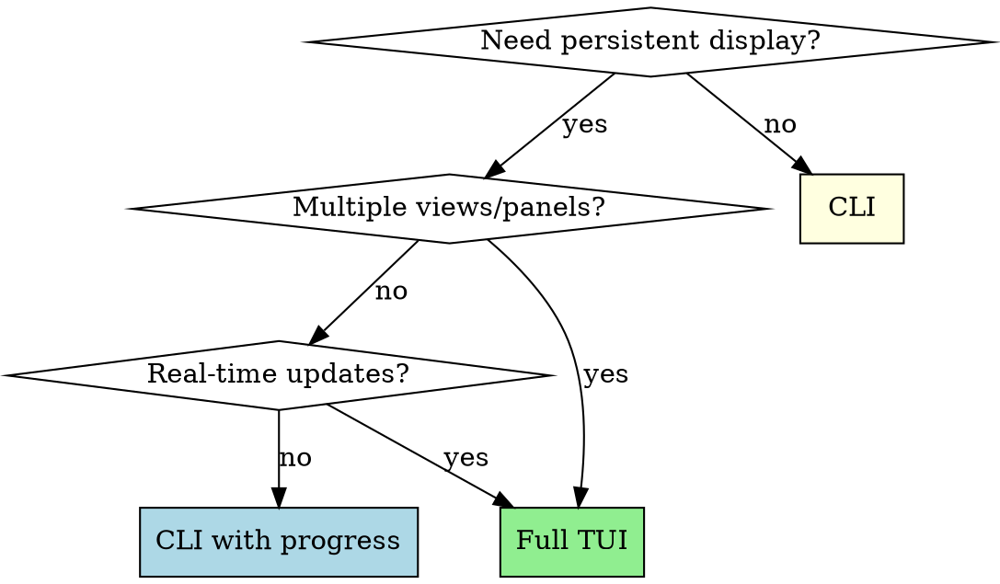
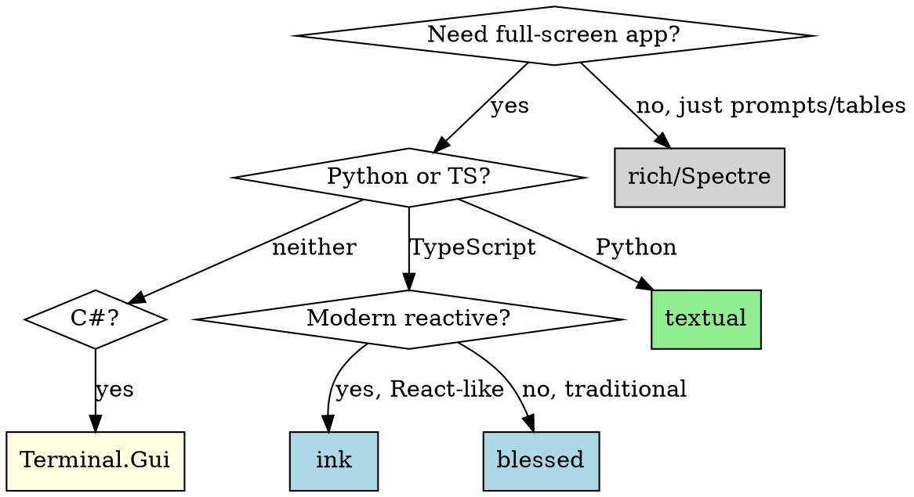
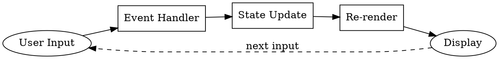

# Building TUI Applications

## Overview

TUIs are **reactive terminal interfaces**. Unlike CLIs (single operation → exit), TUIs maintain state, handle events, and update displays continuously. Think of them as web apps for the terminal.

## When to Use TUI



**TUI is right when:** Dashboard monitoring, file browsers, log viewers, interactive data exploration, multi-step wizards with navigation
**CLI is better when:** Single operation, piping output, scripting, simple progress display

## Quick Reference: Libraries by Language

| Language | Full TUI Framework | Simple Interactive |
|----------|-------------------|-------------------|
| **Python** | `textual` (modern, reactive) | `rich` (tables, progress, prompts) |
| **TypeScript** | `ink` (React-like) or `blessed` | `inquirer` (prompts only) |
| **C#** | `Terminal.Gui` (full widgets) | `Spectre.Console` (tables, prompts) |

### Library Selection Flowchart



## Core Architecture Pattern

```
┌─────────────────────────────────────────────────────────┐
│                        App                               │
│  ┌─────────────┐  ┌─────────────┐  ┌─────────────────┐  │
│  │    State    │→ │   Widgets   │→ │     Render      │  │
│  │  (reactive) │  │ (compose)   │  │  (on change)    │  │
│  └─────────────┘  └─────────────┘  └─────────────────┘  │
│         ↑                                    │          │
│         └────────── Events ←─────────────────┘          │
└─────────────────────────────────────────────────────────┘
```

All modern TUI frameworks use this reactive pattern:
1. **State changes** → triggers re-render
2. **Events** (keyboard, mouse, resize) → update state
3. **Widgets** compose into layouts

## Python: Textual

### Basic Structure

```python
from textual.app import App, ComposeResult
from textual.widgets import Header, Footer, DataTable, Static
from textual.reactive import reactive
from textual.containers import Horizontal, Vertical

class DashboardApp(App):
    """Main TUI application."""

    CSS = """
    #sidebar { width: 30; }
    #main { width: 1fr; }
    """

    BINDINGS = [
        ("q", "quit", "Quit"),
        ("r", "refresh", "Refresh"),
        ("enter", "select", "Select"),
    ]

    # Reactive state - changes trigger UI updates
    selected_id: reactive[str | None] = reactive(None)
    items: reactive[list] = reactive([])

    def compose(self) -> ComposeResult:
        """Build the UI tree."""
        yield Header()
        with Horizontal():
            yield DataTable(id="table")
            yield Static(id="detail")
        yield Footer()

    def on_mount(self) -> None:
        """Called when app starts."""
        self.load_data()

    def watch_selected_id(self, new_id: str | None) -> None:
        """Called automatically when selected_id changes."""
        self.update_detail_panel(new_id)

    def action_refresh(self) -> None:
        """Handle 'r' key."""
        self.load_data()

    async def load_data(self) -> None:
        """Load data without blocking UI."""
        self.items = await self.fetch_items()
```

### Key Patterns

**Workers for async operations:**
```python
from textual.worker import Worker

class MyApp(App):
    @work(exclusive=True)
    async def fetch_data(self) -> None:
        """Run in background, won't block UI."""
        result = await api.get_items()
        self.items = result

    def on_worker_state_changed(self, event: Worker.StateChanged) -> None:
        """Handle worker completion."""
        if event.state == WorkerState.SUCCESS:
            self.refresh_table()
```

**Custom widgets:**
```python
from textual.widget import Widget
from textual.message import Message

class NoticeCard(Widget):
    """Custom widget with message passing."""

    class Selected(Message):
        def __init__(self, notice_id: str) -> None:
            self.notice_id = notice_id
            super().__init__()

    def on_click(self) -> None:
        self.post_message(self.Selected(self.notice_id))
```

## TypeScript: Ink

### Basic Structure

```tsx
import React, { useState, useEffect } from 'react';
import { render, Box, Text, useInput, useApp } from 'ink';

const Dashboard = () => {
    const [items, setItems] = useState<Item[]>([]);
    const [selectedIndex, setSelectedIndex] = useState(0);
    const { exit } = useApp();

    // Handle keyboard input
    useInput((input, key) => {
        if (input === 'q') exit();
        if (key.upArrow) setSelectedIndex(i => Math.max(0, i - 1));
        if (key.downArrow) setSelectedIndex(i => Math.min(items.length - 1, i + 1));
        if (key.return) handleSelect(items[selectedIndex]);
    });

    // Load data on mount
    useEffect(() => {
        loadItems().then(setItems);
    }, []);

    return (
        <Box flexDirection="column">
            <Box borderStyle="single" padding={1}>
                <Text bold>Dashboard</Text>
            </Box>
            <Box flexDirection="row">
                <ItemList items={items} selected={selectedIndex} />
                <DetailPanel item={items[selectedIndex]} />
            </Box>
        </Box>
    );
};

render(<Dashboard />);
```

### Key Patterns

**Reactive updates:**
```tsx
import { useEffect, useState } from 'react';

const LiveStatus = () => {
    const [status, setStatus] = useState('loading');

    useEffect(() => {
        const interval = setInterval(async () => {
            const data = await fetchStatus();
            setStatus(data);
        }, 1000);
        return () => clearInterval(interval);
    }, []);

    return <Text color={status === 'ok' ? 'green' : 'red'}>{status}</Text>;
};
```

## C#: Terminal.Gui

### Basic Structure

```csharp
using Terminal.Gui;

class Program
{
    static void Main()
    {
        Application.Init();

        var top = Application.Top;

        var win = new Window("Dashboard")
        {
            X = 0, Y = 1,
            Width = Dim.Fill(),
            Height = Dim.Fill()
        };

        var listView = new ListView(items)
        {
            X = 0, Y = 0,
            Width = Dim.Percent(30),
            Height = Dim.Fill()
        };

        var detailView = new TextView()
        {
            X = Pos.Right(listView) + 1,
            Y = 0,
            Width = Dim.Fill(),
            Height = Dim.Fill()
        };

        listView.SelectedItemChanged += (args) => {
            detailView.Text = GetDetails(items[listView.SelectedItem]);
        };

        win.Add(listView, detailView);
        top.Add(win);

        Application.Run();
        Application.Shutdown();
    }
}
```

## Layout Patterns

### Responsive Layout

Handle terminal resize gracefully:

```python
# Textual - automatic with CSS
CSS = """
#sidebar {
    width: 30;
}
@media (width < 80) {
    #sidebar { display: none; }
}
"""
```

```typescript
// Ink - useStdout hook
import { useStdout } from 'ink';

const ResponsiveLayout = () => {
    const { stdout } = useStdout();
    const width = stdout.columns;

    return (
        <Box flexDirection={width < 80 ? 'column' : 'row'}>
            {width >= 80 && <Sidebar />}
            <MainContent />
        </Box>
    );
};
```

### Common Layouts

```
┌────────────────────────────────┐     ┌────────────────────────────────┐
│           Header               │     │   Sidebar   │      Main        │
├──────────┬─────────────────────┤     │             │                  │
│ Sidebar  │       Main          │     │   ──────    │                  │
│          │                     │     │   Item 1    │    Detail View   │
│  Nav     │    Content          │     │   Item 2    │                  │
│          │                     │     │   Item 3    │                  │
├──────────┴─────────────────────┤     │             │                  │
│           Footer               │     └─────────────┴──────────────────┘
└────────────────────────────────┘
      Master-Detail                        Sidebar + Content
```

## State Management



**Rules:**
1. **Single source of truth** - One place for each piece of state
2. **Unidirectional flow** - Events → State → Render
3. **Reactive updates** - Use reactive/useState, not manual refresh

## Performance

### Avoid Re-render Storms

```python
# Bad - triggers re-render per item
for item in items:
    self.items.append(item)  # Each append triggers render!

# Good - single update
self.items = new_items  # One render
```

### Virtualization for Large Lists

```python
# Textual DataTable handles this automatically
# For custom widgets, only render visible items

def render_visible(self):
    viewport_start = self.scroll_offset
    viewport_end = viewport_start + self.height
    visible_items = self.items[viewport_start:viewport_end]
    # Only render visible_items
```

### Debounce Rapid Updates

```python
from textual.timer import Timer

class LiveDashboard(App):
    def __init__(self):
        self._pending_updates = []
        self._update_timer: Timer | None = None

    def queue_update(self, data):
        self._pending_updates.append(data)
        if not self._update_timer:
            self._update_timer = self.set_timer(0.1, self._flush_updates)

    def _flush_updates(self):
        # Process all pending updates at once
        self.process_batch(self._pending_updates)
        self._pending_updates = []
        self._update_timer = None
```

## Keyboard Navigation

### Standard Keybindings

| Key | Action |
|-----|--------|
| `↑/↓` or `j/k` | Navigate items |
| `Enter` | Select/confirm |
| `Escape` | Cancel/back |
| `q` | Quit |
| `?` | Help |
| `/` | Search |
| `Tab` | Next panel |

### Focus Management

```python
# Textual
class MyApp(App):
    def action_next_panel(self) -> None:
        self.screen.focus_next()

    def action_prev_panel(self) -> None:
        self.screen.focus_previous()
```

## Async Operations: The Worker Pattern

**Critical rule:** Never block the main thread. TUIs freeze if you make synchronous network/file calls.

### Python Textual Workers

```python
from textual.app import App
from textual.worker import Worker, WorkerState

class DashboardApp(App):
    def on_mount(self) -> None:
        # Start worker - doesn't block UI
        self.run_worker(self.fetch_data())

    async def fetch_data(self) -> None:
        """Runs in background thread."""
        result = await api.get_items()  # Network call
        self.items = result  # Update state when done

    def on_worker_state_changed(self, event: Worker.StateChanged) -> None:
        if event.state == WorkerState.ERROR:
            self.show_error(str(event.worker.error))
```

### TypeScript Ink

```tsx
const Dashboard = () => {
    const [data, setData] = useState<Data | null>(null);
    const [loading, setLoading] = useState(true);

    useEffect(() => {
        // Async in useEffect - doesn't block render
        (async () => {
            const result = await fetchData();
            setData(result);
            setLoading(false);
        })();
    }, []);

    if (loading) return <Text>Loading...</Text>;
    return <DataView data={data} />;
};
```

### C# Terminal.Gui

```csharp
// Use Application.MainLoop.Invoke for thread-safe UI updates
Task.Run(async () => {
    var data = await FetchDataAsync();
    Application.MainLoop.Invoke(() => {
        listView.SetSource(data);  // Update UI on main thread
    });
});
```

## Accessibility

1. **High contrast by default** - Don't rely only on color
2. **Screen reader text** - Provide text alternatives
3. **Keyboard-only navigation** - Everything accessible via keyboard

```python
# Textual - use semantic widgets
from textual.widgets import Button, Label

# Bad - visual only
yield Static("[bold red]Error![/]")

# Good - semantic + visual
yield Label("Error: File not found", id="error", classes="error")
```

## Anti-Patterns

| Anti-Pattern | Problem | Fix |
|--------------|---------|-----|
| Blocking main thread | UI freezes | Use workers/async |
| Manual screen clear | Flicker | Use framework's render |
| Global state mutations | Race conditions | Use reactive state |
| Not handling resize | Broken layout | Test with small terminals |
| Hardcoded dimensions | Not portable | Use relative sizing (Dim.Fill, percentages) |
| No keyboard shortcuts | Mouse-dependent | Add BINDINGS/useInput |
| Polling in render | CPU spin | Use timers, events |

## Testing TUI Apps

### Python with Textual

```python
from textual.testing import AppTest

async def test_dashboard():
    async with AppTest(DashboardApp()) as app:
        # Wait for mount
        await app.wait_for_loaded()

        # Check initial state
        table = app.query_one("#table", DataTable)
        assert table.row_count > 0

        # Simulate key press
        await app.press("down")
        await app.press("enter")

        # Check result
        detail = app.query_one("#detail", Static)
        assert "selected" in detail.render()
```

### Testing Strategies

1. **Snapshot tests** - Compare rendered output
2. **Interaction tests** - Simulate key presses, verify state
3. **State tests** - Directly test state management logic
4. **Integration tests** - Test with real backend (mocked API)

## File Structure

```
my_tui/
├── app.py              # Main App class
├── screens/            # Full-screen views
│   ├── main.py
│   └── detail.py
├── widgets/            # Reusable components
│   ├── sidebar.py
│   └── status_bar.py
├── state/              # State management
│   └── store.py
├── api/                # Backend communication
│   └── client.py
├── styles.css          # Textual CSS (if using)
└── tests/
    └── test_app.py
```
