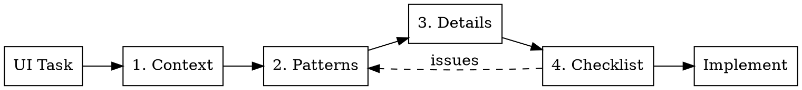
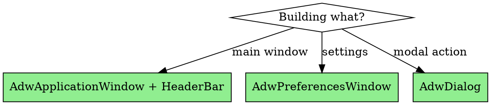
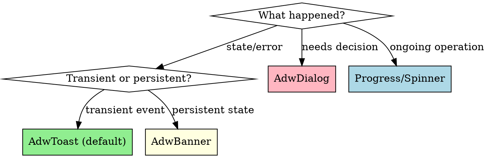

# Designing GNOME UI

Design GNOME UIs that are HIG-compliant, polished, and user-centered.

**Core principle:** No UI code without design decisions. Pattern selection and quality verification happen before implementation.

**Quality layers:** Compliance (follows HIG) → Polish (feels premium) → Rigor (handles edge cases)

**Companion skill:** For app architecture (lifecycle, threading, GSettings, actions, packaging), use `developing-gtk-apps`.

## What's New (libadwaita 1.6-1.8)

| Need | Widget/API | Notes |
|------|------------|-------|
| Exclusive toggles (view mode) | `AdwToggleGroup` | Replaces multiple `GtkToggleButton` |
| Loading indicator | `AdwSpinner` | Works with animations disabled |
| Persistent bottom controls | `AdwBottomSheet` | Music player, persistent actions |
| Wrapping content (tags) | `AdwWrapBox` | Auto-wraps like text |
| Inline view switching | `AdwInlineViewSwitcher` | For cards, sidebars |
| Keyboard shortcuts | `AdwShortcutsDialog` | Replaces deprecated `GtkShortcutsWindow` |
| System accent color | Automatic | Apps follow desktop preference via portal |
| System fonts | `AdwStyleManager` | Access monospace/document fonts |

**Deprecations:** `.dim-label` → use `.dimmed` class

```python
# AdwToggleGroup - view mode switching
toggle_group = Adw.ToggleGroup()
toggle_group.add(Adw.Toggle(icon_name="view-grid-symbolic", name="grid"))
toggle_group.add(Adw.Toggle(icon_name="view-list-symbolic", name="list"))
toggle_group.connect("notify::active-name", lambda g, p: set_view(g.get_active_name()))
header.pack_start(toggle_group)

# AdwBottomSheet - music player controls
bottom_sheet = Adw.BottomSheet()
bottom_sheet.set_content(main_content)
bottom_sheet.set_sheet(player_controls)
bottom_sheet.set_open(True)  # Show sheet
window.set_content(bottom_sheet)

# AdwWrapBox - tag display
wrap_box = Adw.WrapBox(spacing=6)
for tag in ["Python", "GTK", "GNOME", "libadwaita"]:
    chip = Gtk.Label(label=tag)
    chip.add_css_class("chip")  # Custom styling
    wrap_box.append(chip)

# System fonts (1.7+) - for code editors, document views
style_manager = Adw.StyleManager.get_default()
mono_font = style_manager.get_monospace_font_name()  # User's preferred mono font
doc_font = style_manager.get_document_font_name()    # User's preferred document font
# Also available as CSS: --monospace-font-family, --document-font-family
```

## The Process



1. **Context:** User goal, app type, constraints (screen size, input)
2. **Patterns:** Select containers, navigation, controls, feedback
3. **Details:** Typography, spacing, icons, writing style
4. **Checklist:** Verify compliance, polish, rigor before code

## Container Selection



| Scenario | Default | Notes |
|----------|---------|-------|
| App window | `AdwApplicationWindow` + `AdwHeaderBar` | Remember user size, start ~800x600 |
| Settings | `AdwPreferencesWindow` | Handles groups, search, subpages |
| List of items | `AdwPreferencesGroup` with rows | Boxed list style |
| Primary action | Single button, header bar end | `suggested-action` class if emphasized |
| Destructive action | `destructive-action` class | Requires undo or confirmation |

## Navigation Selection

| Structure | Default Pattern |
|-----------|-----------------|
| Single view | None needed |
| 2-4 views | `AdwViewSwitcher` in header bar |
| Many/dynamic views | `AdwNavigationSplitView` (sidebar) |
| Hierarchical | `AdwNavigationView` (drill-down) |

## Control Defaults

| Need | Default | Avoid |
|------|---------|-------|
| On/Off | `AdwSwitchRow` | Checkbox for settings |
| Choose one (few) | `AdwComboRow` | Radio buttons outside dialogs |
| Choose one (many) | `AdwComboRow` + search | Long unsearchable dropdowns |
| Text input | `AdwEntryRow` | Bare `GtkEntry` |
| Multiline text | `GtkTextView` + `card` class | Bare unstyled text view |
| Number | `AdwSpinRow` | Text entry for numbers |
| Date | `GtkCalendar` in popover | Text entry for dates |
| Action in list | `AdwActionRow` + suffix button | Multiple buttons per row |
| Search | `GtkSearchBar` + toggle button | Always-visible search box |

### Search Bar Pattern

```python
# Search bar slides down from header, toggle with button or Ctrl+F
search_bar = Gtk.SearchBar()
search_entry = Gtk.SearchEntry()
search_bar.set_child(search_entry)
search_bar.connect_entry(search_entry)
search_bar.set_key_capture_widget(window)  # Type-to-search

# Toggle button in header bar
search_btn = Gtk.ToggleButton(icon_name="system-search-symbolic")
search_btn.set_tooltip_text("Search")
search_bar.bind_property("search-mode-enabled", search_btn, "active",
    GObject.BindingFlags.BIDIRECTIONAL | GObject.BindingFlags.SYNC_CREATE)
header.pack_end(search_btn)
toolbar_view.add_top_bar(search_bar)
```

### Form Validation Pattern

```python
# Use error CSS class on invalid fields
def validate_entry(row):
    text = row.get_text()
    if not text or len(text) < 3:
        row.add_css_class("error")
        row.set_tooltip_text("Name must be at least 3 characters")
        return False
    row.remove_css_class("error")
    row.set_tooltip_text("")
    return True

name_row.connect("changed", lambda r: validate_entry(r))
```

**Validation timing:** On change for format checks, on focus-out for expensive checks, on submit for final validation.

## List Widget Selection

| Content | Widget | Why |
|---------|--------|-----|
| Settings/preferences | `AdwPreferencesGroup` | Boxed list style, handles rows |
| Navigation list (sidebar) | `GtkListBox` | Selection support, activatable rows |
| Large/dynamic data | `GtkListView` | Virtual scrolling, performance |
| Grid of items | `GtkGridView` | Thumbnail grids, icon views |

**Selection modes:** Use `Gtk.SingleSelection` for navigation, `Gtk.MultiSelection` for bulk actions. Toggle selection mode with header bar button + action bar for bulk operations. See reference for code patterns.

## Iconography

**Rules:**
- Symbolic icons only (outline, monochrome) - never full-color in UI
- Source from GNOME Icon Library (`icon-library` app)
- Header bar: icon-only buttons, always add tooltips
- Naming: `action-object-symbolic` (e.g., `list-add-symbolic`)
- **Dynamic icons:** Update icon name based on state (e.g., `user-trash-symbolic` → `user-trash-full-symbolic`)

| Action | Icon |
|--------|------|
| Add/New | `list-add-symbolic` |
| Delete | `user-trash-symbolic` |
| Settings | `emblem-system-symbolic` |
| Menu | `open-menu-symbolic` |
| Search | `system-search-symbolic` |
| Edit | `document-edit-symbolic` |
| Back | `go-previous-symbolic` |
| Drill-down | `go-next-symbolic` |
| Sync | `emblem-synchronizing-symbolic` |
| Offline | `network-offline-symbolic` |
| Warning | `dialog-warning-symbolic` |
| Error | `dialog-error-symbolic` |
| Select mode | `selection-mode-symbolic` |
| Check/Done | `emblem-ok-symbolic` |
| Close | `window-close-symbolic` |
| Refresh | `view-refresh-symbolic` |

## Feedback Selection



| Scenario | Default | Details |
|----------|---------|---------|
| Action done | `AdwToast` | Short message, optional undo |
| Destructive action | `AdwToast` + undo | Prefer over confirmation dialog |
| Error (recoverable) | `AdwToast` | Brief, auto-retry silently |
| Error (blocking) | `AdwDialog` | Explain problem and required fix |
| Persistent state | `AdwBanner` | Offline, degraded mode, auth required |
| Needs decision | `AdwDialog` | Conflicts, irreversible actions |
| Short wait (<5s) | `AdwSpinner` | No progress bar |
| Long operation (>30s) | Progress bar + text | "13 of 42 processed" |

**Error escalation:** Toast (transient) → Banner (persists) → Dialog (requires action)
- Network blip: Toast, auto-retry
- Prolonged offline: Banner with "Retry" button
- Auth expired: Dialog + Banner until resolved

**Dialog rules:**
- Cancel button first (left), action button last (right)
- Specific verbs ("Delete", "Save"), never "OK" or "Yes"
- Destructive actions use `destructive-action` style

**Context menus:** Use `GtkPopoverMenu` for right-click actions (remove, rename, properties). Keep menus short; move complex actions to dialogs.

### Empty State Pattern

```python
# Show placeholder when list is empty
empty_state = Adw.StatusPage(
    icon_name="folder-symbolic",
    title="No Projects",
    description="Create a project to get started"
)
create_btn = Gtk.Button(label="Create Project")
create_btn.add_css_class("pill")
create_btn.add_css_class("suggested-action")
empty_state.set_child(create_btn)

# Use stack to switch between list and empty state
stack.add_named(list_view, "content")
stack.add_named(empty_state, "empty")
stack.set_visible_child_name("empty" if model.get_n_items() == 0 else "content")
```

## Quality Checklist

**Create TodoWrite items for each applicable check before implementing.**

### Layer 1: Compliance

- [ ] Correct container type and header bar structure
- [ ] Navigation pattern matches content structure
- [ ] Standard widgets used (not custom where native exists)
- [ ] Symbolic icons from GNOME Icon Library
- [ ] Typography uses style classes (`title-1`, `heading`, `body`, `caption`)
- [ ] Libadwaita spacing defaults (no custom margins)
- [ ] Header capitalization for labels, sentence for descriptions

### Layer 2: Polish

- [ ] Clear visual hierarchy - important elements prominent
- [ ] Controls and text properly aligned
- [ ] Consistent patterns throughout
- [ ] Empty states have placeholder page (icon + message + action)
- [ ] Loading states show spinner/skeleton, never frozen UI
- [ ] Smooth resize and view transitions
- [ ] Comfortable density - not cramped, not sparse

### Layer 3: Rigor

- [ ] All controls keyboard-accessible (Tab, Enter, Space)
- [ ] All elements have accessible names for screen readers
- [ ] Works with high contrast (`GTK_THEME=Adwaita:hc`)
- [ ] Works with 200% text scaling
- [ ] Error handling for every input/action
- [ ] Edge cases handled (empty lists, long text, missing data)
- [ ] Destructive actions have undo where possible
- [ ] Responsive: works at 800x600, adapts to larger

## Accessibility Quick Check

```bash
# Test high contrast
GTK_THEME=Adwaita:hc ./myapp

# Test large text (set in GNOME Settings > Accessibility first)

# Test with screen reader
orca &
./myapp

# Keyboard-only: unplug mouse, navigate entire app with Tab/Enter/Space
```

**Code:** Set accessible labels for icon-only buttons and images:
```python
button.update_property([Gtk.AccessibleProperty.LABEL], ["Add new item"])
image.update_property([Gtk.AccessibleProperty.LABEL], ["Project thumbnail"])
```

## Red Flags - STOP

- Custom styling where libadwaita has a pattern
- Multiple "suggested" or "destructive" buttons per view
- Confirmation dialogs for reversible actions (use undo)
- Text over images or textured backgrounds
- Non-GNOME icons without strong justification
- Missing tooltips on icon-only header bar buttons
- Generic labels ("OK", "Yes", "No", "Submit")
- Frozen UI during operations (missing loading states)

## Non-GTK Apps (Qt/PySide6)

When styling Qt apps for GNOME:
- Use Adwaita-qt or manual QSS matching Adwaita colors
- Follow same patterns conceptually (header bar → toolbar, etc.)
- Match spacing, typography scale, and icon style
- Test alongside native GNOME apps for consistency

## Reference Files

| Need | File |
|------|------|
| Basic UI patterns | `gnome-hig-reference.md` |
| Advanced patterns | `gnome-advanced-patterns.md` |

**gnome-hig-reference.md** - Read for most apps:
- Container, navigation, control, feedback patterns with code
- Search bar, form validation, **filter models**, grid views, selection modes
- File chooser dialogs, dark/light mode, responsive breakpoints
- Primary menu structure, About dialog, Shortcuts window
- Typography, writing style, **CSS color variables**, common mistakes
- **Accessibility testing** commands (high contrast, screen reader)
- **Phone/tablet breakpoints**, adaptive layouts

**gnome-advanced-patterns.md** - Read when building:
- Drag & drop (reordering, file drops, cross-widget DnD)
- Undo/Redo (command pattern, history management)
- Tabs (AdwTabView, multi-document apps)
- System notifications (GNotification vs Toast)
- Media display (image viewers, video controls, **pinch-to-zoom gestures**)
- Split/Paned views (resizable panels)
- Welcome/Onboarding (first-run, feature callouts)
- Popovers (tool palettes, color pickers)
- **Keyboard shortcuts** (mnemonics, shortcut controllers)
