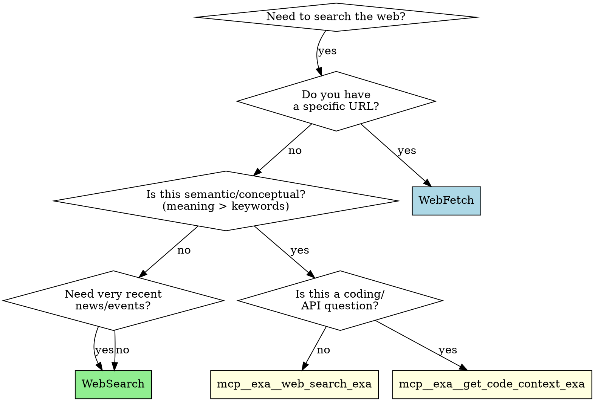

# Exa Semantic Search

## Overview

Exa.ai provides neural semantic search optimized for AI consumption. Use when **meaning matters more than keywords**.

## Decision Flowchart



## Quick Reference

| Scenario | Tool | Why |
|----------|------|-----|
| "Find papers on emergent AI behavior" | `mcp__exa__web_search_exa` | Semantic discovery |
| "Companies similar to Anthropic" | `mcp__exa__web_search_exa` | Similar content |
| "How to use React hooks" | `mcp__exa__get_code_context_exa` | Coding context |
| "Latest news on X" | `WebSearch` | Recency matters |
| "Read this URL: [link]" | `WebFetch` | Known URL |
| "error: module not found XYZ" | `WebSearch` | Exact keyword match |
| "CVE-2024-12345" | `WebSearch` | Specific identifier |

## Tool Usage

### mcp__exa__web_search_exa
```
query: "semantic query describing concepts"
numResults: 8 (default, adjust as needed)
type: "auto" | "fast" | "deep"
```

### mcp__exa__get_code_context_exa
```
query: "React useState hook examples" | "Express middleware patterns"
tokensNum: 5000 (default, 1000-50000 range)
```

## Integration Patterns

**Discovery + Extraction:**
1. Exa finds relevant sources semantically
2. WebFetch extracts full content from best URLs

**Multi-perspective research:**
1. Exa: "academic perspectives on X"
2. Exa: "industry implementation of X"
3. Exa: "critiques of X"
4. Synthesize

**Fallback:**
1. Try Exa for semantic search
2. If results poor, fall back to WebSearch with keywords

## Anti-Patterns

| Don't | Do Instead |
|-------|------------|
| `"python pandas filter dataframe"` | Use WebSearch (keyword query) |
| Run 10 similar queries | Consolidate into 2-3 well-crafted queries |
| `"what is React"` | Use knowledge or WebSearch |
| `"breaking news today"` | Use WebSearch |

## When Results Are Poor

1. Switch search type: `auto` vs `fast` vs `deep`
2. Rephrase: more semantic/descriptive
3. Add domain filters via `allowed_domains`
4. Fall back to WebSearch for keyword matching
