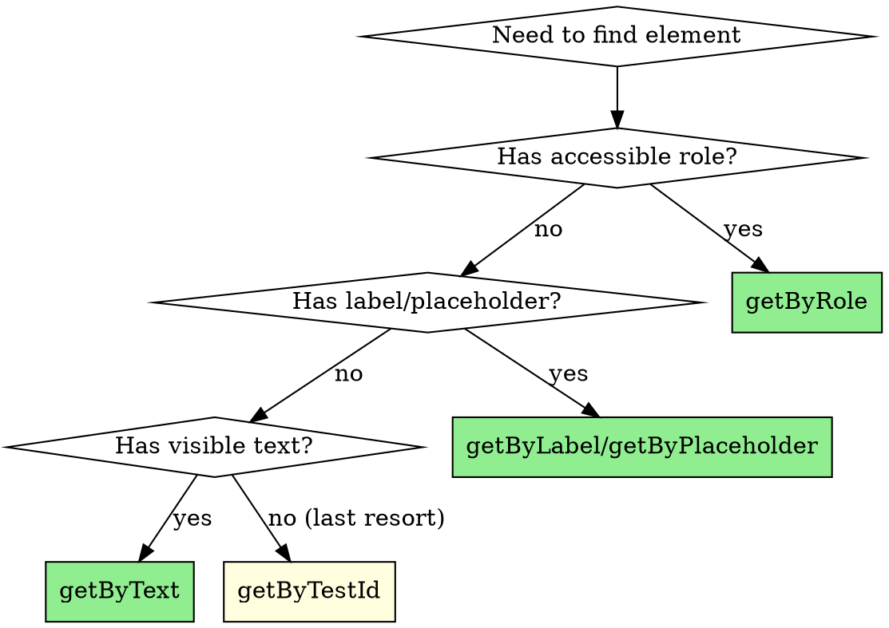
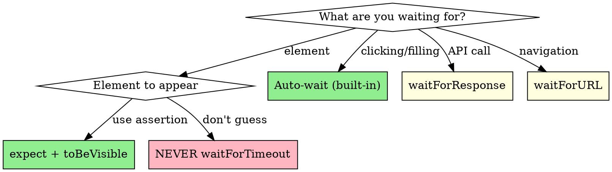

# Playwright Testing

Write reliable, fast, maintainable Playwright tests for SPAs.

## Contents
- Core Concepts (Locators, Waiting, Assertions)
- Test Structure → See [reference/structure.md](reference/structure.md)
- Performance → See [reference/performance.md](reference/performance.md)
- Debugging → See [reference/debugging.md](reference/debugging.md)
- CI Configuration → See [reference/ci.md](reference/ci.md)

**Core principle:** Test what users see and do. If a user can't find an element by its role or text, neither should your test.

**Quality layers:** Reliable (no flakes) → Fast (parallel, minimal waits) → Maintainable (survives refactors)

**Philosophy:** User-centric locators by default. Implementation details (test-ids, CSS selectors) are escape hatches, not first choices.

## The Process

1. **Identify:** What user behavior are we testing?
2. **Locate:** Find elements the way users would (role, label, text)
3. **Act:** Perform user actions (click, fill, navigate)
4. **Assert:** Verify visible outcomes, not internal state
5. **Stabilize:** Handle async, add appropriate waits

## Red Flags - STOP

- `page.locator('.btn-primary')` - CSS class selectors
- `page.waitForTimeout(1000)` - arbitrary sleeps
- `page.locator('[data-testid="x"]')` as first choice
- Testing component internals instead of user outcomes
- Long test files with no page objects or fixtures

## Locator Priority



| Priority | Locator | When to Use | Example |
|----------|---------|-------------|---------|
| 1st | `getByRole` | Buttons, links, inputs, headings, lists | `getByRole('button', { name: 'Submit' })` |
| 2nd | `getByLabel` | Form inputs with labels | `getByLabel('Email address')` |
| 3rd | `getByPlaceholder` | Inputs with placeholder text | `getByPlaceholder('Search...')` |
| 4th | `getByText` | Static text content, paragraphs | `getByText('Welcome back')` |
| 5th | `getByAltText` | Images | `getByAltText('Company logo')` |
| Last | `getByTestId` | Dynamic content, no semantic meaning | `getByTestId('total-price')` |

### Role Examples

```typescript
// Buttons
page.getByRole('button', { name: 'Save changes' })
page.getByRole('button', { name: /submit/i })  // regex for flexibility

// Links
page.getByRole('link', { name: 'View profile' })

// Form inputs
page.getByRole('textbox', { name: 'Username' })
page.getByRole('checkbox', { name: 'Remember me' })
page.getByRole('combobox', { name: 'Country' })

// Structure
page.getByRole('heading', { name: 'Dashboard', level: 1 })
page.getByRole('list').getByRole('listitem')
page.getByRole('dialog', { name: 'Confirm deletion' })

// Tables
page.getByRole('table').getByRole('row', { name: /john/i })
```

### Disambiguating Multiple Matches

```typescript
// Specify which match you want
await page.getByRole('button', { name: 'Delete' }).first().click();
await page.getByRole('listitem').last().click();
await page.getByRole('row').nth(2).click();  // 0-indexed

// Filter by content or child elements
await page.getByRole('listitem').filter({ hasText: 'John' }).click();
await page.getByRole('listitem').filter({
    has: page.getByRole('button', { name: 'Edit' })
}).click();

// Chain locators to scope
await page.getByRole('dialog').getByRole('button', { name: 'Confirm' }).click();
```

### Locator Anti-patterns

| Bad | Why | Good |
|-----|-----|------|
| `.locator('.submit-btn')` | Breaks on class rename | `getByRole('button', { name: 'Submit' })` |
| `.locator('#email-input')` | Coupled to implementation | `getByLabel('Email')` |
| `.locator('div > span:nth-child(2)')` | Extremely brittle | `getByText('...')` or add test-id |
| `getByTestId` everywhere | Misses accessibility bugs | Use semantic locators first |
| Unscoped locator with multiple matches | Flaky, might click wrong element | Use `.first()`, `.filter()`, or scope with parent |

## Waiting & Async

**Playwright auto-waits for most actions.** Don't add manual waits unless you have a specific reason.



### Built-in Auto-Waiting

These actions auto-wait - no manual wait needed:

```typescript
// All of these wait automatically for element to be actionable
await page.getByRole('button', { name: 'Submit' }).click();
await page.getByLabel('Email').fill('test@example.com');
await page.getByRole('checkbox').check();
await page.getByRole('combobox').selectOption('US');
```

### Explicit Waits (When Needed)

```typescript
// Wait for element state (prefer assertions)
await expect(page.getByText('Success')).toBeVisible();
await expect(page.getByRole('button')).toBeEnabled();
await expect(page.getByRole('list')).not.toBeEmpty();

// Wait for navigation
await page.waitForURL('**/dashboard');
await page.waitForURL(url => url.searchParams.has('token'));

// Wait for API response (useful for loading states)
await page.getByRole('button', { name: 'Load data' }).click();
await page.waitForResponse(resp =>
    resp.url().includes('/api/data') && resp.status() === 200
);

// Wait for network idle (use sparingly - can be slow)
await page.waitForLoadState('networkidle');

// Wait for specific request to complete before asserting
const responsePromise = page.waitForResponse('/api/users');
await page.getByRole('button', { name: 'Refresh' }).click();
await responsePromise;
await expect(page.getByRole('list')).toContainText('John');

// Promise.all pattern - click and wait simultaneously
await Promise.all([
    page.waitForResponse(resp => resp.url().includes('/api/data')),
    page.getByRole('button', { name: 'Submit' }).click()
]);
```

### Waiting Anti-patterns

| Bad | Why | Good |
|-----|-----|------|
| `waitForTimeout(2000)` | Arbitrary, slow, still flaky | Wait for specific condition |
| `waitForTimeout(100)` in loop | Polling manually | Use `expect` with auto-retry |
| `waitForLoadState('networkidle')` everywhere | Slow, unreliable with polling | Wait for specific response |
| No wait + immediate assert | Race condition | `expect` auto-retries assertions |

### Assertion Auto-Retry

Playwright assertions auto-retry until timeout. Use this instead of manual waits:

```typescript
// BAD: manual wait then check
await page.waitForTimeout(1000);
const text = await page.getByTestId('status').textContent();
expect(text).toBe('Complete');

// GOOD: auto-retrying assertion
await expect(page.getByText('Complete')).toBeVisible();
```

### Soft Assertions

Use `expect.soft()` to continue testing after assertion failure (collect multiple failures):

```typescript
test('validates all form fields', async ({ page }) => {
    await page.goto('/profile');

    // Soft assertions don't stop the test - useful for checking multiple things
    await expect.soft(page.getByLabel('Name')).toHaveValue('John');
    await expect.soft(page.getByLabel('Email')).toHaveValue('john@example.com');
    await expect.soft(page.getByLabel('Phone')).toHaveValue('555-1234');

    // Test continues even if some assertions fail
    // All failures reported at end
});
```

### Handling Overlays and Popups

Use `addLocatorHandler` when overlays might interfere with test actions:

```typescript
// Setup handler for cookie consent popup
await page.addLocatorHandler(
    page.getByRole('dialog', { name: 'Cookie consent' }),
    async () => {
        await page.getByRole('button', { name: 'Accept' }).click();
    }
);

// Now write test normally - handler auto-dismisses popup if it appears
await page.goto('/dashboard');
await page.getByRole('button', { name: 'Settings' }).click();
```

## Test Structure

For page objects, fixtures, and test organization, see [reference/structure.md](reference/structure.md).

**Quick tips:**
- Page objects encapsulate interactions, not assertions
- Fixtures handle common setup/teardown
- One behavior per test
- Use `test.describe` for grouping related tests

## Performance

For parallel execution, auth optimization, and API shortcuts, see [reference/performance.md](reference/performance.md).

**Quick tips:**
- Reuse auth state via `storageState`
- Create test data via API, not UI
- Use `fullyParallel: true`
- Avoid `waitForLoadState('networkidle')`

## Debugging

For debug mode, traces, and common scenarios, see [reference/debugging.md](reference/debugging.md).

**Quick tips:**
- `npx playwright test --debug` for local debugging
- View traces for CI failures: `npx playwright show-trace trace.zip`
- Use `await page.pause()` to stop and inspect

## CI Configuration

For GitHub Actions, sharding, and CI-specific config, see [reference/ci.md](reference/ci.md).

**Quick tips:**
- `forbidOnly: !!process.env.CI` prevents test.only in CI
- `retries: 2` for CI to handle transient failures
- Upload artifacts for debugging failures

## Quality Checklist

**Create TodoWrite items for each applicable check before finalizing tests.**

### Layer 1: Reliable (No Flakes)

- [ ] No `waitForTimeout()` calls - using condition-based waits
- [ ] Assertions use `expect()` with auto-retry, not manual checks
- [ ] Tests are independent - no shared state between tests
- [ ] Waiting for specific API responses, not `networkidle`
- [ ] Locators are specific enough (single element match)
- [ ] Tests pass consistently (run 5x locally before committing)

### Layer 2: Fast

- [ ] Authentication reused via `storageState`
- [ ] Test data created via API, not UI
- [ ] Tests run in parallel (`fullyParallel: true`)
- [ ] No unnecessary `waitForLoadState('networkidle')`
- [ ] Heavy setup in fixtures, not repeated per test
- [ ] Sharding configured for large test suites

### Layer 3: Maintainable

- [ ] Locators use roles/labels, not CSS selectors
- [ ] Page objects encapsulate interactions
- [ ] Test names describe user action + expected outcome
- [ ] One behavior per test - not testing multiple things
- [ ] Fixtures handle common setup/teardown
- [ ] No magic strings - constants for repeated values

## Common Patterns Reference

| Need | Pattern |
|------|---------|
| Authenticated user | `storageState` fixture |
| Test data setup | API calls in `beforeEach` or fixture |
| Wait for data load | `waitForResponse('/api/...')` |
| Click + wait for response | `Promise.all([waitForResponse(...), click()])` |
| Multiple similar tests | `test.describe` + parameterized data |
| Slow operation | Increase timeout for specific test |
| Modal/dialog | `getByRole('dialog')` then scope within |
| Dropdown selection | `getByRole('combobox').selectOption()` |
| File upload | `setInputFiles()` on file input |
| Hover menu | `locator.hover()` then click revealed item |
| Drag and drop | `locator.dragTo(target)` |
| iframes | `frameLocator()` then scope within |
| New tab/window | `page.waitForEvent('popup')` |
| Multiple matches | `.first()`, `.last()`, `.nth(n)`, `.filter()` |
| Check multiple things | `expect.soft()` for non-blocking assertions |
| Dismiss popups/overlays | `addLocatorHandler()` |

## When to Add data-testid

Use `data-testid` as escape hatch when:

- Element has no semantic role (decorative container)
- Dynamic content with no stable text (generated IDs, prices)
- Multiple identical elements where position matters
- Third-party components without accessible markup

```typescript
// Acceptable: price that changes dynamically
<span data-testid="cart-total">{formatCurrency(total)}</span>
page.getByTestId('cart-total')

// Still prefer scoping with semantic locators
page.getByRole('region', { name: 'Cart' }).getByTestId('total')
```

## Quick Reference Commands

```bash
# Run all tests
npx playwright test

# Run specific file
npx playwright test login.spec.ts

# Run tests matching name
npx playwright test -g "login"

# Run in headed mode
npx playwright test --headed

# Debug mode with inspector
npx playwright test --debug

# Update snapshots
npx playwright test --update-snapshots

# Generate test from recording
npx playwright codegen localhost:3000

# Show last HTML report
npx playwright show-report
```
