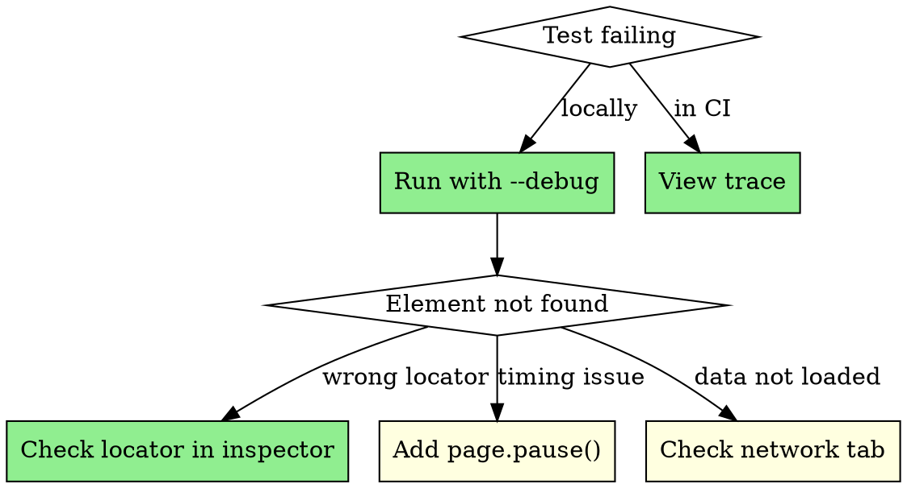

# Debugging Reference

## Contents
- Debug Mode
- Trace Viewer
- Screenshots & Videos
- Console & Network Logging
- Pausing & Stepping
- Common Debugging Scenarios
- Locator Debugging

## Debug Mode

```bash
# Run with headed browser and slow motion
npx playwright test --headed --debug

# Run specific test in debug mode
npx playwright test login.spec.ts:15 --debug

# Open Playwright Inspector
PWDEBUG=1 npx playwright test
```

## Trace Viewer

```typescript
// playwright.config.ts
export default defineConfig({
    use: {
        // Capture trace on first retry (good for CI)
        trace: 'on-first-retry',

        // Or always capture (larger files)
        // trace: 'on',
    },
});
```

```bash
# View trace after test failure
npx playwright show-trace trace.zip

# Traces contain: screenshots, DOM snapshots, network, console logs
```

## Screenshots & Videos

```typescript
// playwright.config.ts
export default defineConfig({
    use: {
        // Screenshot on failure
        screenshot: 'only-on-failure',

        // Record video on failure
        video: 'retain-on-failure',
    },
});

// Manual screenshot in test
await page.screenshot({ path: 'debug.png', fullPage: true });
```

## Console & Network Logging

```typescript
// Log all console messages
page.on('console', msg => console.log('BROWSER:', msg.text()));

// Log all network requests
page.on('request', req => console.log('→', req.method(), req.url()));
page.on('response', res => console.log('←', res.status(), res.url()));

// Log failed requests
page.on('requestfailed', req => {
    console.log('FAILED:', req.url(), req.failure()?.errorText);
});
```

## Pausing & Stepping

```typescript
test('debug this test', async ({ page }) => {
    await page.goto('/dashboard');

    // Pause here and open inspector
    await page.pause();

    // Continue with test...
    await page.getByRole('button', { name: 'Submit' }).click();
});
```

## Common Debugging Scenarios



| Symptom | Likely Cause | Debug Step |
|---------|--------------|------------|
| Element not found | Wrong locator | Use Inspector to find element |
| Element not found (intermittent) | Race condition | Check if waiting for data load |
| Timeout on click | Element obscured | Screenshot before action |
| Different result locally vs CI | Viewport/timing | Check viewport size in config |
| Test passes alone, fails in suite | Shared state | Ensure test isolation |
| Network request fails | API issue | Log requests, check response |

## Locator Debugging

```typescript
// Test your locator interactively
const locator = page.getByRole('button', { name: 'Submit' });

// How many elements match?
console.log('Count:', await locator.count());

// What's the actual text?
console.log('Text:', await locator.textContent());

// Is it visible?
console.log('Visible:', await locator.isVisible());

// Highlight it (in headed mode)
await locator.highlight();
```
