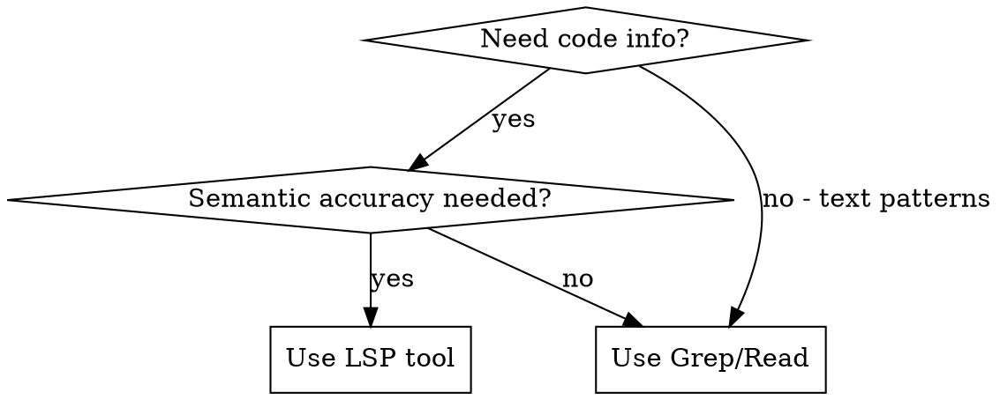

# Using Python LSP

## Overview

The pyright-lsp plugin provides semantic code intelligence for Python. **Use LSP tools instead of grep/read when you need semantic accuracy** - LSP understands Python's type system, inheritance, and symbol relationships.

## When to Use LSP vs Text Search



**Use LSP for:**
- Finding all usages before refactoring
- Getting type information
- Navigating to definitions
- Checking for type errors

**Use Grep for:**
- Text patterns (comments, strings, config)
- Cross-language searches
- When LSP unavailable

## LSP Operations Quick Reference

| Task | LSP Operation | Instead of |
|------|---------------|------------|
| Find all callers of a method | `findReferences` | Grep for method name |
| Get function return type | `hover` | Read file + parse |
| Jump to definition | `goToDefinition` | Grep + Read |
| Check type errors | `getDiagnostics` | Run mypy/pyright CLI |
| View file structure | `documentSymbol` | Read entire file |

## Key Patterns

### Before Refactoring: Find All References

**Wrong approach:**
```
Grep for "method_name" -> may miss aliased calls, get false positives
```

**Right approach:**
```
LSP findReferences on method -> gets ALL semantic usages, no false positives
```

### Getting Type Information

**Wrong approach:**
```
Read file -> find function -> parse return annotation manually
```

**Right approach:**
```
LSP hover on symbol -> instant type signature with docs
```

### Verifying Type Correctness

**Wrong approach:**
```
Bash: pipx run mypy src/ (slow, external tool)
```

**Right approach:**
```
LSP getDiagnostics on changed files -> instant, no external process
```

## Common Mistakes

| Mistake | Why It's Wrong | Fix |
|---------|----------------|-----|
| Grep for symbol before rename | Text search misses method calls through aliases, inheritance | Use `findReferences` |
| Read entire file for one type | Wastes context, slow | Use `hover` |
| Run mypy after every change | Slow, requires external tool | Use `getDiagnostics` |
| Grep to find definition | May find wrong match (same name, different module) | Use `goToDefinition` |

## How LSP Tools Work

LSP is a **built-in Claude Code tool**, not a bash command. When pyright-lsp plugin is enabled, Claude Code automatically provides these operations:
- `goToDefinition` - navigate to where symbol is defined
- `findReferences` - find all usages of a symbol
- `hover` - get type signature and documentation
- `getDiagnostics` - get type errors for a file
- `documentSymbol` - list all symbols in a file

**You invoke these through Claude's tool system, not via bash.** If LSP is unavailable, fall back to grep/read but document the limitation.

## Prerequisites

1. **Plugin enabled:** `pyright-lsp@claude-plugins-official` in `~/.claude/settings.json`
2. **Pyright installed:** `pip install pyright` or `npm install -g pyright`
3. **Project configured:** `pyproject.toml` or `pyrightconfig.json` present (recommended)

## Fallback Strategy

If LSP is unavailable (tool not found, server not running):

1. **Document the limitation** - note that you're using text search as fallback
2. **Use Grep with caution** - understand it may miss aliased calls or inheritance
3. **Verify manually** - for refactoring, double-check results make sense semantically
4. **Suggest fix** - remind user to ensure pyright is installed and plugin enabled

## Red Flags - Stop and Use LSP

These thoughts mean you should use LSP, not grep:

| Thought | Reality |
|---------|---------|
| "Let me grep for this function" | If it's a symbol, use `findReferences` |
| "I'll read the file to find the type" | Use `hover` for instant type info |
| "Let me run mypy to check" | Use `getDiagnostics` - faster, no subprocess |
| "I'll search for where this is defined" | Use `goToDefinition` - semantic accuracy |
| "Grep is faster for quick searches" | LSP is 900x faster for semantic queries |

## When LSP Won't Help

- No pyright binary installed
- Working with dynamic Python (heavy `eval`, `exec`, `__getattr__`)
- Cross-language references
- Comment/docstring searches
- Projects without type hints (LSP works but limited value)
