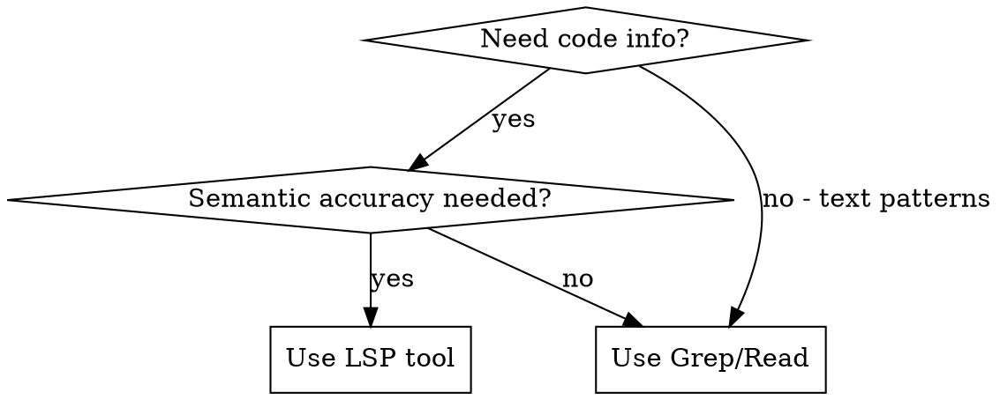

# Using TypeScript LSP

## Overview

The typescript-lsp plugin provides semantic code intelligence for TypeScript and JavaScript. **Use LSP tools instead of grep/read when you need semantic accuracy** - LSP understands TypeScript's type system, inheritance, interfaces, and symbol relationships.

## When to Use LSP vs Text Search



**Use LSP for:**
- Finding all usages before refactoring
- Getting type information (inferred or explicit)
- Navigating to definitions (including node_modules)
- Checking for type errors
- Understanding interface implementations

**Use Grep for:**
- Text patterns (comments, strings, config files)
- Cross-language searches
- JSON, YAML, markdown content
- When LSP unavailable

## LSP Operations Quick Reference

| Task | LSP Operation | Instead of |
|------|---------------|------------|
| Find all callers of a function | `findReferences` | Grep for function name |
| Get function/variable type | `hover` | Read file + parse |
| Jump to definition | `goToDefinition` | Grep + Read |
| Check type errors | `getDiagnostics` | Run tsc CLI |
| View file structure | `documentSymbol` | Read entire file |

## Key Patterns

### Before Refactoring: Find All References

**Wrong approach:**
```
Grep for "formatDuration" -> may miss renamed imports, get false positives from comments
```

**Right approach:**
```
LSP findReferences on symbol -> gets ALL semantic usages, no false positives
```

### Getting Type Information

**Wrong approach:**
```
Read file -> find function -> manually trace type inference
```

**Right approach:**
```
LSP hover on symbol -> instant type signature with inferred types resolved
```

### Verifying Type Correctness

**Wrong approach:**
```
Bash: npx tsc --noEmit (slow, external process)
```

**Right approach:**
```
LSP getDiagnostics on changed files -> instant, no subprocess
```

### Finding Interface Implementations

**Wrong approach:**
```
Grep for "implements InterfaceName" -> misses duck-typed objects
```

**Right approach:**
```
LSP findReferences on interface -> finds all implementations including structural matches
```

## Common Mistakes

| Mistake | Why It's Wrong | Fix |
|---------|----------------|-----|
| Grep for symbol before rename | Text search misses aliased imports, re-exports | Use `findReferences` |
| Read entire file for one type | Wastes context, slow | Use `hover` |
| Run tsc after every change | Slow, external tool | Use `getDiagnostics` |
| Grep to find definition | May find wrong match (same name, different module) | Use `goToDefinition` |
| Grep for interface usages | Misses structural/duck typing | Use `findReferences` |

## How LSP Tools Work

LSP is a **built-in Claude Code tool**, not a bash command. When typescript-lsp plugin is enabled, Claude Code automatically provides these operations:
- `goToDefinition` - navigate to where symbol is defined
- `findReferences` - find all usages of a symbol
- `hover` - get type signature and documentation
- `getDiagnostics` - get type errors for a file
- `documentSymbol` - list all symbols in a file

**You invoke these through Claude's tool system, not via bash.** If LSP is unavailable, fall back to grep/read but document the limitation.

## Supported File Types

`.ts`, `.tsx`, `.js`, `.jsx`, `.mts`, `.cts`, `.mjs`, `.cjs`

## Prerequisites

1. **Plugin enabled:** `typescript-lsp@claude-plugins-official` in `~/.claude/settings.json`
2. **Language server installed:** `npm install -g typescript-language-server typescript`
3. **Project configured:** `tsconfig.json` or `jsconfig.json` present (recommended for accuracy)

## Checking LSP Availability

**Always try LSP first.** If the LSP tools aren't available, they'll return an error. Don't preemptively fall back to grep just because you're unsure.

```
1. Attempt LSP operation (e.g., findReferences)
2. If tool error → fall back to grep/read with documented limitation
3. If success → use the semantic results
```

## Fallback Strategy

If LSP is unavailable (tool not found, server not running):

1. **Document the limitation** - explicitly state: "LSP unavailable, using text search as fallback"
2. **Use Grep with caution** - understand it may miss aliased imports or re-exports
3. **Verify manually** - for refactoring, double-check results make sense semantically
4. **Suggest fix** - remind user to ensure typescript-language-server is installed and plugin enabled

**Never silently fall back.** Always tell the user when you're using text search instead of LSP so they understand the limitations.

## Red Flags - Stop and Use LSP

These thoughts mean you should use LSP, not grep:

| Thought | Reality |
|---------|---------|
| "Let me grep for this function" | If it's a symbol, use `findReferences` |
| "I'll read the file to find the type" | Use `hover` for instant type info |
| "Let me run tsc to check" | Use `getDiagnostics` - faster, no subprocess |
| "I'll search for where this is defined" | Use `goToDefinition` - semantic accuracy |
| "Grep is faster for quick searches" | LSP is faster for semantic queries |
| "I need to find all implementations" | Use `findReferences` - catches structural matches |

## When LSP Won't Help

- No typescript-language-server binary installed
- Working with pure JavaScript without jsconfig.json (limited type inference)
- Cross-language references (e.g., TypeScript calling Rust via WASM)
- Comment/string literal searches
- Config files (JSON, YAML, etc.)
- Node modules not installed (`npm install` needed first)
