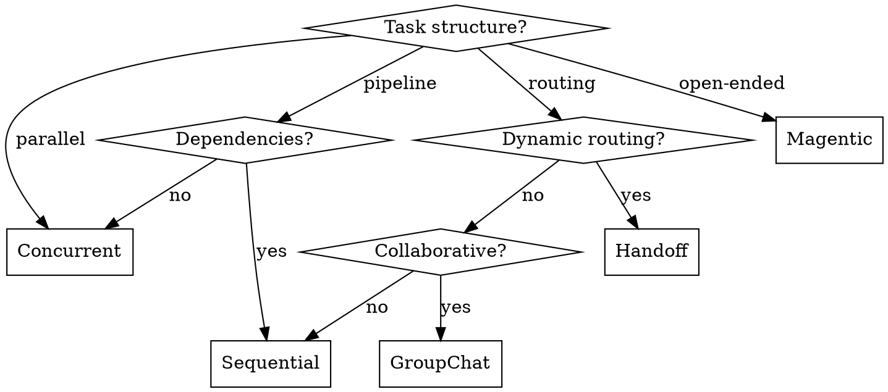

# Orchestration Patterns

Five core patterns for multi-agent coordination. Choose based on task structure.

## Pattern Selection Guide

| Pattern | Use When | Avoid When |
|---------|----------|------------|
| **Sequential** | Clear dependencies, pipeline stages | Tasks can parallelize |
| **Concurrent** | Independent perspectives needed | Agents must build on each other |
| **Handoff** | Unknown optimal agent upfront | Risk of infinite loops |
| **GroupChat** | Collaborative ideation needed | More than 3 agents |
| **Magentic** | Complex open-ended problems | Simple deterministic workflows |

## 1. Sequential Orchestration

Agents execute in predefined order. Each agent's output becomes next agent's input.

```csharp
ChatCompletionAgent analystAgent = new()
{
    Name = "Analyst",
    Instructions = "You are a marketing analyst. Analyze the market trends.",
    Kernel = kernel,
};

ChatCompletionAgent writerAgent = new()
{
    Name = "Copywriter",
    Instructions = "You are a copywriter. Write compelling copy based on the analysis.",
    Kernel = kernel,
};

ChatCompletionAgent reviewerAgent = new()
{
    Name = "Reviewer",
    Instructions = "You review and improve the copy.",
    Kernel = kernel,
};

SequentialOrchestration orchestration = new(analystAgent, writerAgent, reviewerAgent);

InProcessRuntime runtime = new();
await runtime.StartAsync();
var result = await orchestration.InvokeAsync("Analyze electric vehicle market", runtime);
Console.WriteLine(await result.GetValueAsync());
```

**Best for**: Draft → review → polish, ETL pipelines, approval workflows

## 2. Concurrent Orchestration

Multiple agents execute simultaneously on same input. Results aggregated.

```csharp
// Three analysts with different perspectives
var optimistAgent = chatClient.CreateAIAgent(
    instructions: "Analyze from optimistic perspective.", name: "Optimist");
var pessimistAgent = chatClient.CreateAIAgent(
    instructions: "Analyze from pessimistic perspective.", name: "Pessimist");
var realistAgent = chatClient.CreateAIAgent(
    instructions: "Analyze from realistic perspective.", name: "Realist");

ConcurrentOrchestration<string, Analysis> orchestration = new(
    optimistAgent, pessimistAgent, realistAgent)
{
    ResultTransform = async (results) =>
    {
        // Aggregate all perspectives into final analysis
        return new Analysis { Perspectives = results.ToList() };
    }
};

var result = await orchestration.InvokeAsync("Should we enter the EV market?", runtime);
```

**Best for**: Multiple independent analyses, ensemble reasoning, time-sensitive parallel work

## 3. Handoff Orchestration

Agents dynamically transfer control based on context. Mesh topology — no central orchestrator.

```csharp
var triageAgent = chatClient.CreateAIAgent(
    instructions: "You route questions to the appropriate expert.",
    name: "Triage");

var mathTutor = chatClient.CreateAIAgent(
    instructions: "You help with math questions.",
    name: "MathTutor");

var historyTutor = chatClient.CreateAIAgent(
    instructions: "You help with history questions.",
    name: "HistoryTutor");

var workflow = AgentWorkflowBuilder.StartHandoffWith(triageAgent)
    .WithHandoffs(triageAgent, [mathTutor, historyTutor])
    .WithHandoff(mathTutor, triageAgent)      // Can route back
    .WithHandoff(historyTutor, triageAgent)   // Can route back
    .WithMaxHandoffs(10)                      // CRITICAL: Prevent infinite loops
    .Build();

await foreach (var message in workflow.InvokeStreamingAsync("What is calculus?", runtime))
{
    Console.Write(message.Text);
}
```

### Handoff vs Agent-as-Tools

| Aspect | Handoff | Agent-as-Tools |
|--------|---------|----------------|
| Control Flow | Explicitly passed; no central authority | Primary agent delegates, control returns |
| Task Ownership | Receiving agent takes full ownership | Primary agent retains responsibility |
| Context | Full context transferred | Only relevant info provided |
| Use Case | Dynamic expertise routing | Specialized subtask delegation |

**Best for**: Customer service routing, dynamic expertise selection, exploratory workflows

**CRITICAL**: Always set termination conditions to prevent infinite handoff loops:
```csharp
.WithMaxHandoffs(10)                              // Limit total handoffs
.WithTerminationStrategy(new MaxTurnsTerminationStrategy(15))  // Or custom strategy
```

## 4. GroupChat Orchestration

Managed conversation where agents collaborate through shared thread.

```python
# Python example - shows selector pattern
def smart_selector(state: GroupChatStateSnapshot) -> str | None:
    round_idx = state["round_index"]
    conversation = state["conversation"]

    if round_idx >= 10:
        return None  # Stop after 10 rounds

    if round_idx == 0:
        return "Researcher"  # Always start with researcher

    last_speaker = conversation[-1].speaker
    last_text = getattr(conversation[-1], "text", "").lower()

    # Ping-pong between researcher and writer
    if "?" in last_text and last_speaker == "Researcher":
        return "Writer"
    return "Writer" if last_speaker == "Researcher" else "Researcher"

group_chat = GroupChat(
    agents=[researcher, writer, reviewer],
    selector=smart_selector,
    max_rounds=10
)
```

**Best for**: Brainstorming, collaborative editing, decision-making through debate

**Best practice**: Limit to 3 or fewer agents to maintain control.

## 5. Magentic Orchestration

Based on Microsoft Research's Magentic-One. Manager agent builds dynamic task ledger.

### Two-Loop Architecture

```
┌─────────────────────────────────────────────────────────┐
│                    OUTER LOOP                           │
│         Manages Task Ledger (persistent plan)           │
├─────────────────────────────────────────────────────────┤
│  Task Ledger contains:                                  │
│  - Facts: Verified information                          │
│  - Guesses: Hypotheses to verify                        │
│  - Plan: Steps to complete task                         │
└─────────────────────────────────────────────────────────┘
                         │
                         ▼
┌─────────────────────────────────────────────────────────┐
│                    INNER LOOP                           │
│         Manages Progress Ledger (execution)             │
├─────────────────────────────────────────────────────────┤
│  Progress Ledger contains:                              │
│  - Current progress toward task                         │
│  - Next agent assignment                                │
│  - Stall detection (2+ cycles = revise plan)           │
└─────────────────────────────────────────────────────────┘
```

### Default Agent Team

| Agent | Role |
|-------|------|
| **Orchestrator** | High-level planning, directing, tracking progress |
| **WebSurfer** | Commands Chromium-based browser for web tasks |
| **FileSurfer** | Navigates local files |
| **Coder** | Writes and analyzes code |
| **ComputerTerminal** | Console access for code execution |

**Best for**: Complex problems without predetermined solutions, autonomous exploration

### C# Magentic Status (as of Jan 2026)

Magentic orchestration is **Python-first**. For C#:

1. **Use GroupChat for most multi-agent scenarios** - it's the closest C# equivalent
2. **Use Handoff with termination conditions** for dynamic routing needs
3. **Recommended**: Use Sequential or Handoff for most workflows

### C# Magentic Implementation Pattern

If you truly need Magentic's two-loop architecture:

```csharp
// Ledger structures
public record TaskLedger(
    List<string> Facts,       // Verified information
    List<string> Guesses,     // Hypotheses to verify
    List<string> Plan);       // Steps to complete task

public record ProgressLedger(
    int CurrentStep,
    int StallCounter,         // Increments when no progress
    string? LastAgentOutput);

// Outer Loop: Task Ledger Management
public class OuterLoop(IChatClient chatClient)
{
    public async Task<TaskLedger> CreateInitialPlanAsync(string task)
    {
        var response = await chatClient.CompleteAsync(
            $"Analyze task and create plan. Task: {task}. " +
            "Output JSON: {{facts: [], guesses: [], plan: []}}");
        return JsonSerializer.Deserialize<TaskLedger>(response.Text);
    }

    public async Task<TaskLedger> RevisePlanAsync(
        TaskLedger current, ProgressLedger progress, string stallReason)
    {
        var response = await chatClient.CompleteAsync(
            $"Plan stalled: {stallReason}. Current: {JsonSerializer.Serialize(current)}. " +
            "Revise the plan. Output JSON.");
        return JsonSerializer.Deserialize<TaskLedger>(response.Text);
    }
}

// Inner Loop: Progress Ledger Management
public class InnerLoop(AIAgent[] agentTeam)
{
    private ProgressLedger _progress = new(0, 0, null);

    public bool IsStalled => _progress.StallCounter >= 2;

    public async Task<string> ExecuteStepAsync(TaskLedger task, AgentThread thread)
    {
        var step = task.Plan[_progress.CurrentStep];
        var agent = SelectAgentForStep(step);
        var result = await agent.RunAsync(step, thread);

        // Detect progress
        if (result == _progress.LastAgentOutput)
            _progress = _progress with { StallCounter = _progress.StallCounter + 1 };
        else
            _progress = new(_progress.CurrentStep + 1, 0, result);

        return result;
    }
}

// Orchestrator coordinates both loops
public class MagenticOrchestrator(IChatClient chatClient, AIAgent[] agentTeam)
{
    public async IAsyncEnumerable<OrchestrationUpdate> ExecuteStreamingAsync(string task)
    {
        var outer = new OuterLoop(chatClient);
        var inner = new InnerLoop(agentTeam);
        var taskLedger = await outer.CreateInitialPlanAsync(task);
        var thread = new ChatHistoryAgentThread();

        while (!IsComplete(taskLedger))
        {
            if (inner.IsStalled)
            {
                yield return new("Replanning", "Stall detected, revising plan");
                taskLedger = await outer.RevisePlanAsync(taskLedger, /* progress */, "No progress");
            }

            var result = await inner.ExecuteStepAsync(taskLedger, thread);
            yield return new("Progress", result);
        }
    }
}
```

**When to use Magentic**: Complex open-ended problems requiring multiple specialists and adaptive replanning.

**When NOT to use**: Simple tasks where Sequential or Handoff suffices. Magentic adds significant complexity.

## Workflow Execution Runtime

```csharp
// Create and start runtime
InProcessRuntime runtime = new();
await runtime.StartAsync();

// Execute orchestration
OrchestrationResult result = await orchestration.InvokeAsync(task, runtime);
string output = await result.GetValueAsync();

// Wait for all background work
await runtime.RunUntilIdleAsync();
```

## Workflow-as-Agent Pattern

Wrap workflows to expose unified agent API:

```csharp
var workflow = AgentWorkflowBuilder
    .CreateSequentialPipeline(researchAgent, writerAgent, reviewerAgent)
    .Build();

// Wrap as agent
AIAgent pipelineAgent = workflow.AsAgent(
    id: "content-pipeline",
    name: "Content Pipeline",
    description: "Multi-agent content creation workflow"
);

// Use like any other agent
AgentThread thread = pipelineAgent.GetNewThread();
var response = await pipelineAgent.RunAsync("Write about AI trends", thread);
```

## Checkpointing and Fault Tolerance

```csharp
var checkpointManager = CheckpointManager.Default;

// Execute with checkpointing
await using Checkpointed<StreamingRun> checkpointedRun =
    await InProcessExecution.StreamAsync(workflow, input, checkpointManager);

// Save checkpoint for later
var savedCheckpoint = await checkpointedRun.CreateCheckpointAsync();

// Resume from checkpoint (after crash/restart)
await InProcessExecution.ResumeStreamAsync(savedCheckpoint, checkpointManager);
```

### Executor State Persistence

```csharp
public class MyExecutor : Executor
{
    private int _processedCount;

    protected override async ValueTask OnCheckpointingAsync(
        IWorkflowContext context, CancellationToken ct)
    {
        // Save state before checkpoint
        await context.QueueStateUpdateAsync("processedCount", _processedCount, ct);
    }

    protected override async ValueTask OnCheckpointRestoredAsync(
        IWorkflowContext context, CancellationToken ct)
    {
        // Restore state after checkpoint
        _processedCount = await context.ReadStateAsync<int>("processedCount", ct);
    }
}
```

## Human-in-the-Loop

```python
# Python example
@ai_function(approval_mode="always_require")
def process_refund(order_number: str) -> str:
    return f"Refund processed for order {order_number}."

# Tool call will pause for human approval before executing
```

## Anti-Patterns

| Don't | Do |
|-------|-----|
| Use Magentic for simple pipelines | Use Sequential |
| Add agents without specialization | Each agent needs clear expertise |
| Share mutable state between agents | Use explicit message passing |
| Ignore handoff loop risk | Implement max handoff counts |
| Skip termination conditions | Add round limits, completion criteria |

## Choosing the Right Pattern


